# Adam Karvon
<samp>Physicist</samp>

> Welcome to my portfolio! I specialize in machine learning, statistical modeling, and data science, with a strong background in extracting insights from complex, high-dimensional datasets. I am passionate about applying advanced computational techniques to solve challenging, real-world problems.

<!-- Self-generating ASCII portrait from GitHub Actions -->
<picture>
  
</picture>

[LinkedIn](https://www.linkedin.com/in/adamkarvon) | [My Resume](./Adam_Karvon_CV.pdf) | [Portfolio Site](#)

---

## Tech Stack & Skills
- **Languages:** <samp>Python</samp> (Pandas, NumPy, SciPy), <samp>MATLAB</samp>, <samp>R</samp>, <samp>SQL</samp>
- **Machine Learning & AI:** <samp>TensorFlow</samp>, <samp>Keras</samp>, <samp>Scikit-Learn</samp>, Deep Learning (CNNs, NNs), Bayesian Inference (MCMC, Gaussian Processes), PCA
- **Data Domains:** High-dimensional array processing, fMRI/Neuroimaging data (<samp>.cifti</samp>, <samp>.gifti</samp>), Astronomical data (Galaxy Zoo)

---

## Featured Projects

### Brain Vortices Analysis (fMRI)
A computational neuroscience project focused on analyzing functional magnetic resonance imaging (fMRI) data to detect and quantify cortical vorticity. 
- **What it solves:** Extracts functional brain connectivity maps and processes dense 3D/4D spatial data to identify complex flow-like dynamic structures (vortices) in the brain.
- **Approach:** Wrote custom MATLAB scripts to read and manipulate <samp>.dtseries.nii</samp> (CIFTI) and GIFTI surface files, applying vector calculus algorithms directly to structural brain meshes.
- **Impact:** Provided robust visualization and quantitative measurements of brain surface topology over time.
- **Technologies:** <samp>MATLAB</samp>, Medical Imaging (fMRI, CIFTI/GIFTI)

### Galaxy Morphology Predictor (CNN Regression)
A deep learning model trained to predict continuous structural properties of galaxies using the Galaxy Zoo dataset.
- **What it solves:** Automates the estimation of galactic morphologies which would otherwise require massive crowdsourced human effort.
- **Approach:** Built and trained a Convolutional Neural Network (CNN) with dense regression layers using Keras and TensorFlow. Utilized L1/L2 regularization to prevent overfitting on the high-dimensional astronomical arrays.
- **Technologies:** <samp>Python</samp>, <samp>TensorFlow</samp>, <samp>Keras</samp>, <samp>NumPy</samp>

### Advanced Statistical Modeling & Inference (Bayesian ML)
A comprehensive suite of statistical modeling implementations showcasing rigorous data science methodologies.
- **What it solves:** Demonstrates the ability to extract highly accurate parameter estimates and uncertainty quantifications from noisy data.
- **Approach:** 
  - Implemented **Markov Chain Monte Carlo (MCMC)** algorithms for sampling complex posterior distributions.
  - Developed **Gaussian Process (GP)** models for non-parametric regression.
  - Built custom **Bootstrapping** pipelines for empirical confidence interval estimations.
  - Implemented **Principal Component Analysis (PCA)** from scratch for dimensionality reduction.
- **Technologies:** <samp>Python</samp>, <samp>SciPy</samp>, <samp>Scikit-Learn</samp>, Bayesian Inference

### MNIST Neural Network Weight Propagation
A custom implementation of feedforward propagation and weight initialization strategies.
- **What it solves:** Demonstrates a fundamental understanding of neural network architectures underneath the hood, beyond just calling high-level APIs.
- **Approach:** Programmed dense layer weight propagations to classify handwritten digits (MNIST) efficiently.
- **Technologies:** <samp>Python</samp>, Deep Learning Fundamentals

---

## GitHub Stats
<!-- Generated locally by GitHub Actions - no third party widgets! -->
<picture>
  
</picture>
 
<picture>
  
</picture>
 
<picture>
  
</picture>

## Get In Touch
*   **Email:** adam.karvon@example.com (Update with real email)
*   I am currently open to new opportunities in Data Science and Machine Learning. Let's connect!
